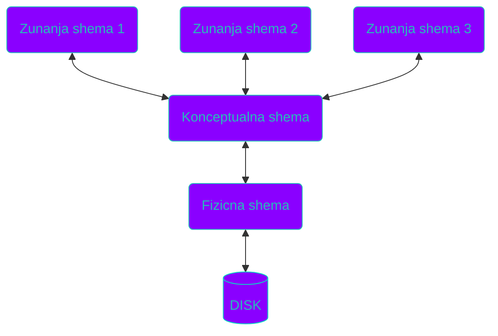

# 1. Uvod
- _Kaj je vodenje?_
	- Vodenje je dejavnost, s katero vplivamo na delovanje sistema - procesa -z namenom, da dosezemo nek cilj.
- _Kaj so vhodi v algoritem vodenja?_
	- Informacija o stanju procesa
	- Informacija o zelenem obnasanju procesa
	- Ukazi operaterja
- _Kaj je cilj vodenja?_
	- Razlikujejo se glede na nivo vodenja, na osnovnem nivoju so:
		- Zagotavljanje zelenih vrednosti procesnih velicin
		- Zagotavljanje pravilnega zaporedja operacij
	- Na visjih nivojih so:
		- Cim boljsi izkoristek proizvodnih sredstev (vodenje proizvodnje)
		- Cim vecji dobicek (vodenje poslovanja)
		- Cim samostojnejse delovanje v spremenjenem okolju (vodenje avtonomnih sistemov)
- _Predstavi procesne vmesnike_
	- Procesni vmesniki omogocajo prenos informacij med racunalnikom in realnim svetom, njihove funkcije so:
		- A/D pretvorba
		- D/A pretvorba
		- digitalni I/O
		- stevci, sinhronizacijske funkcije
- _Nastej tipe racunalnikov, primerne za vodenje procesov_
	- Mikrokrmilniki
	- PLC
	- Industrijski zancni regulatorji
	- Industrijski (procesni) racunalniki
- _Vodenje zveznega procesa_
	- Proces daljsi cas tece brez prekinitev, spreminjajo se nekateri parametri, vendar ne cel postopek.
	- Vodenje zagotavlja zelene vrednosti velicin in omogoca cimkrajsi prehod iz enih na druge obratovalne parametre
- _Vodenje kosovnega procesa_
	- Zagotavljati moramo pravilno zaporedje operacij in transport obdelovancev na njihove delovne postajhe v pravem zaporedju
	- Prevladuje sekvencno vodenje
- _Sekvencno vodenje_
	- Kot vhodne signale uporabljamo dvopolozajne senzorje, npr koncna stikala in kapacitivne senzorje blizine...
	- Aktuatorji so prav tako dvostanjski, npr. releji, kontaktorji, ki so zvezani na motorje ali grelece, ki morajo delovati s konstantimi parametri
- _Vodenje sarznih procesov_
	- Z zaporedjem operacij se proizvede dolocena kolicina produkta, oziroma ena __šarža__ 
	- Tako zaporedje se ponavlja
	- Pri vodenju moramo zagotavljati pravilno zaporedje operacij
	- Znotraj posamezne operacije zagotavljamo pravilne obratovalne parametre
	

# 2. Programirljivi logicni krmilniki
- So najpogostejsi nacin izvedbe logicnega in sekvencnega vodenja v industriji
- _Definicija PLC_
	- Digitalna elektronska naprava, ki na podlagi ukazov, shranjenih v pomnilniku, izvaja logicne, sekvencne, casovne in iaritmeticne operacije ter s tem vodi razlicne naprave in procese prek binarnih in analognih vhodov in izhodov
- _Nastej mozne izvedbe logicnega in ekvencnega krmilja_
	- Krmilnik
	- Relejska vezja
	- Integrirana vezja
	- Mirko krmilniki
	- PLC
- _Opisi relejska krmilja_
	- Starejsa izvedba krmilja
	- Prepsosta, pregledna in enostavno diagnosticirana vezja
	- Prostorsko neucinkovita, velika poraba, zamudna dokumentacija, nezanesljivost mehanskih delov
- _Opisi elektronska krmilja_
	- Manjse od relejskih krmilij
	- Tezavno za predelave
	- Vecja obcutljivost na EM motnje, kot pri relejski izvedbi
	- Scasoma so tehnologijo izrinila programirljiva digitalna vezja (mikrokrmilniki, FPGA, PLC...)
- _Opisi mikroprocesorski PLK_
	- Je posebna oblika procesnega racunalnika
	- Prirejena izkljucno za vodenje procesov (logicno in sekvencno)
	- Vecja zanesljivost zaradi pomanjkanja mehanskih delov
	- Hitro in enostavno spreminjanje delovanja
	- Moznost komunikacije z drugimi napravami
- _Opisi kako deluje PLK_
	- PLK deluje v 3 locenih stanjih:
		- _Branje vhodov:_ Stanje vhodov se preslika v pomnilnik, temu pravimo vhodna slika
		- _Izvajanje programa:_ Glede na vhodna stanja se izracunajo naslednja stanja izhodov vezja
		- _Pisanje na izhode:_ Izhodi se postavijo v skladu z izracuni prejsnjega koraka, ki so se shranili v pomnilnik, od koder se nato stanje izhodov preslika na same izhode
- _V katerih jezikih programiramo PLK?_
	- Standard IEC 61131 narekuje 4 standardizirane jezike za programiranje PLK
	- _Structured Text:_ Visokonivojski tekstovni jezik
	- _Instruction List:_ Nizkonivojski tekstovni jezik, podoben assemblyju
	- _Ladder Diagramme:_ Izvira iz relejskih vezij, med 2 priklopni sponki vezemo kontakte in tuljave v logicne funkcije
	- _Function Block Diagramme:_ Izhaja iz simbolov logicnih vrat v digitalni elektroniki, vezemo logicna vrata in tako dobimo kompleksnejse funkcije
	- _Sequential Function Chart:_ Predstavlja stanje sistema in prehode med njimi ter pogoje, da se ti prehodi zgodijo. Obicajno ga uporabljamo v kombinaciji z ostalimi jeziki
- _Predstavi mednarodni standard_ __IEC 61131__
	- Namenjen je poenotenju delovanja, uporabe in programiranja PLK
	- Skrbi za prenosljivost programov, povezljivost krmilnikov v komunikacijska omrezja
	- __IEC 61131 (1-2)
		1. Splosni del, vsebuje terminologijo, definicije pojmov
		2. Definira zahteve za strojno opremo, elektricne, mehanske in funkcionalne zahteve, servisne pogoje, skladiscenje, transportna pravila, postopke za preverjanje skladnosti s standardom
	- __IEC 61131 (3-5)
		3. Programiranje, struktura programa, jeziki, sintaksa in semantika
		4. Uporabniske smernice, analiza in specifikacije zahtev, izbira, izvedba in vzdrzevanje PLK
		5. Komunikacije, definira kom. funkcijske bloke, ki jih uporabljamo pri programiranju
	- __Dodatni deli__
		- _IEC 61131 - 6:_ varnostne funkcionalne zahteve za PLK
		- _IEC 61131 - 7:_ Programiranje PLK z uporabo mehke logike (fuzzy logic)
		- _IEC 61131 - 8:_ Smernice za uporabo in implementacijo programskih jezikov
- _Opisi skupno programsko osnovo_
	- Skupno programsko osnovo sestavlja _struktura programa_, ki opisuje konfiguracijo, vire, opravila in programske organizacijske enote (funkcijski bloki...), _podatkovni tipi in spremenljivke_, _standardne funkcije in funkcijski bloki_, _vsi elementi, ki so skupni vsem programom, ne glede na uporabljen programski jezik_
	- Posebnosti:
	![[Pasted image 20230131165204.png]]

- _Nastej mozne izvedbe PLK_
	- Kompaktna - vse je vgrajeno v en modul, nizja cena, manjsa prilagodljivost
	- Modularna - prilagodljiva, zahravnejsa konfiguracija, visja cena
- _Opisi CPU PLK-ja_
	- Vsebuje lahko enega ali vec mikroprocesorjev, lahko tudi poseben enobitni koprocesor, ki skrbi le za izvajanje logicnih bitnih operacij
	- Vsebuje watch dog vezje, ki poskrbi za preklic procesa, ce le-ta potrebuje predolgo casa, da se izvede, kar najverjetneje signalizira napako.
	- Ura realnega casa
	- Pomnilnik, ki se deli na 3 dele.
		- Sistemski del (ROM, EEPROM)
		- Uporabniski del (RAM, EPROM, EEPROM)
		- Baterijska podpora, pri kratkocasnih izpadih napajanja
- _Opisi I/O modul PLK_
	- Pri enostavnih krmilnikih so naceloma to le binarni vhodi in izhodi, pri kompleksnejsih pa imamo sirok nabor razlicnih modulov:
		- Binarni I/O
		- Analogni I/O
		- Komunikacijski moduli
		- Posebni funkcijski moduli
			- hitri stevci
			- pozicijski senzorji
			- regulatorji
			- fuzzy logic
			- strojni vid
			- RF
			- _Moduli za interakcijo z operaterjem_
	- Vhodi in izhodi so za zascito krmilnika naceloma galvansko loceni od njega, vsebujejo tudi filtre za decoupling visokofrekvencnih motenj ter zascito pred prenapetostnimi sunki
- _Predstavi zmogljivostne razrede PLK-jev_
	- _Mikro PLK_ ima do 32 I/O pinov, uporabljamo jih za avtomatizacijo manjsih naprav, pogosto zelo enostavna izvedba strukture, potencialno nimajo galvanske locitve vhodov in izhodov
	- _Mali PLK_ ima do 128 I/O pinov, pogosto uporabljen kot zamenjava relejske logike in vsebujejo le binarni I/O
	- _Srednji PLK_ ima do 1024 I/O pinov, zmore tako sekvencno, kot enostavnejse vodenje, ima visjo frekvenco procesorja in dobre komunikacijske zmoznosti
	- _Veliki PLK_ ima vec tisoc I/O pinov, zmore kompleksne operacije, lahko ima tudi vec procesorjev

# 3. Nacrtovanje logicnega in sekvencnega vodenja
- _Predstavi sklope nacrtovanja_
	- Poznamo 2 sklopa,
	- _Nacrtovanje elektricnih povezav_ med krmilnikom ali drugim tipom racunalnika in procesno periferijo, ko jo predstavljajo senzorji in akturatorji. Sem sodi tudi nacrtovanje ustreznega napajanje vseh uporabljenih naprav
	- _Nacrtovanje krmilnega algoritma_, s katerim programiramo krmilnik, da bo izvajal ustrezno vodenje procesa. Posvecamo se nacrtovanju krmilnih programov in algoritmov
- _Kako se izvaja program PLK?_
	- Program PLK se izvaja v zanki, I//O se bere/postavlja le enkrat na cikel programske zanke
- _Kako so s PLK realizirana kombinacijska krmilja?_
	- Realizirana so z logicnimi funkcijami
	- Funkcije operirajo z binarnimi signali in lahko zavzemajo le vrednosti _"true"_ in _"false"_ 
	- Poznamo _delovne_ in _mirovne_ kontakte, razlikujejo se v privzetem stanju kontakta
	- Boolove preklopne funkcije zapisujemo v kanonicni obliki in sicer v obliki _mintermov_ (Boolov produkt / AND) ali _maksteromov_ (Boolova vsota / OR)
- _Kako so s PLK realizirana sekvencna krmilja?_
	- Izhodi so poleg vhodnih vrednosti odvisni tudi od _notranjih stanj_, ki jih hrani notranji pomnilnik
	- Krmilja ne moremo opisati vhodno/izhodno pravilnostno tabelo
	- Locujemo jih na _prostodelujoca_ in _koracno delujoca_ krmilja, kjer se pri prvem lahko vhodne spremenljivke pojavljajo v poljubnem zaporedju, pri drugem pa v _tocno dolocenem_\
	- Pri _koracnih krmiljih_ se med izvajanjem operacije lahko spremenijo le tisti vhodi, ki so povezani s to operacio, ki se izvaja. To posledicno _znatno zmanjsa stevilo notranjjih stanj in preklopov_. Za nacrtovanje uporabljamo 2 pristopa:
		- _Dogodkovni pristop_, kjer stanja izhodov spreminjamo ob nastopu dogodkov, torej na vhodih _detektiramo prehode, ne pa stanja_, uporabljamo _latching izhode_
		- _Pristop z notranjimi stanji_, kjer spreminjamo izhode glede na kombinacijo trenutnega stanja in vhodnih vrednosti, uporabljamo _non - latching izhode_
- _Nastej prednosti in slabosti dogodkovnega pristopa in pristopa z notranjimi stanji_
	- Dogodkovni pristop:
		- + manjsi in enostavnejsi program
		- - tezja vrnitev v zacetno stanje
		- - tezje diagnosticiranje zaradi razprsenega postavljanja in brisanja stanj
	- Pristop z notranjimi stanji
		- + Manjsa obcutljivost na sumne signale in motnje
		- + Enostavnejse odkrivanje napak in lazje popravljanje
		- - Obseznejsi program
- _Kako izvedemo direktno koracno krmilje s SFC_
	- Za kompleksnost realnih problemov bi bil le en SFC preobsezen, zato obicajno uporabimo vec diagramov za razlicna opravila
	- Za akcije znotraj stanj uporabimo "podrejeni SFC" 
	- Resetiranje stanj in ponovni zagon sta s to izvedbo problematicna
- _Kako nacrtujemo prosto delujoca krmilja?_
	- Pri nacrtovanju izhajamo iz tabele stanj
	- Uporabljamo Huffmanov postopek
	- __DOPOLNI: HUFFMANOV POSTOPEK__

# 4. Industrijski regulatorji in regulacijski algoritmi
- _Predstavi zgradbo industrijskega regulatorja_
	- Sestavljen je iz:
		- Vhodno - izhodne enote, ki vsebuje:
			- A/D in D/A pretvornike
			- Binarne vhode in izhode
			- Komunikacijske vmesnike
		- Mikroracunalniskega jedra, ki vsebuje:
			- Mikroprocesor
			- RAM, ROM, EEPROM
		- Napajalne enote
		- Ohisja s celno plosco
		- In povezave z okolico, ki sestoji iz:
			- Prilagoditve signalov
			- Galvanske locitve in prenapetostne zascite
			- Prikljucnih sponk
- _Predstavi programsko zasnovo obeh sort digitalnih regulatorjev._
	- _Preprosti digitalni regulatorji_ imajo fiksno strukturo regulacijskega algoritma, ki temelji na standardnem PID, lahko mu spreminjamo parametre in vklapljamo/izklapljamo pomozne funkcije, kot so filtri, linearizacije...
	- _Zmogljivi digitalni regulatorji_ imajo prilagodljivo strukturo, algoritem je sestavljen iz funkcijskih blokov, te lahko izbiramo in povezujemo med sabo med _konfiguracijo_. Med postopkom _parametriranja_ pa mu dolocamo vrednosti parametrov blokov
- _Predstavi osnovne funkcijske bloke zancnih regulatorjev_
	- _Aritmeticni bloki_ opravljajo aritmeticne funkcije, kot so seštevanje, odštevanje, množenje, deljenje, potenciranje, korenjenje, logaritem, trigonometrične funkcije, absolutna vrednost...
	- _Logicni bloki_ opravljajo logicne operacije, kot so AND, OR, logicno negacijo, XOR, pomnilne celice, stevci...
	- _Primerjalni in preklopni bloki_ opravljajo operacije min, max, primerjave, mrtvi hod, omejitev izhoda...
	- _Casovni bloki_ kot ON timer, OFF timer, PULSE timer
- _Predstavi kompleksne funkcijske bloke zancnih regulatorjev_
	- _Linearizacijski in korekcijski_ opravljajo linearno in parabolicno korelacijo, korekcijo karakteristike termoclenov, korekcijske formule za pretok plinov
	- _Bloki za obdelavo signalov_, mednje sodijo digitalni filtri, integrator, diferenciator, clen 1. reda
	- _Logicno - casovni_ bloki, kamor sodita multiplekser in programator
	- _Vhodno izhodni_ bloki upravljajo z analognimi, in digitalnimi vhodi/izodi, tipkami, prikazovalniki...
- _Predstavi regulacijske bloke_
	- Locimo jih na stopenjske in zvezne, najosnovnejsi regulator je dvo ali trostopenjski, uporablja se za pocasne procese, npr. regulacijo temperature ali nivoja tekocine
	- Zvezni regulacijski bloki uporabljajo variacijo algoritma PID, mozne so razlicne vezave posameznih clenov. Kot vhodne signale lahko sprejemajo regulirno velicino in referenco, pogresek ali locene vhode za posamezen clen. Podpira zvezne ali pulzne izhodne signale. Izvedba algoritma variira od proizvajalca do proizvajalca.
- _Opisi PID regulacijo_
	- Izod PID je sestavljen iz prispevkov posameznih clenov, prispevek vsakega clena je funkcija vhodnega pogreska
	- $$Prispevek \space P \space clena: K_{P}\cdot e(t)$$$$Prispevek \space I \space clena: K_{I}\cdot \int^{t}_{0}e(\tau)\cdot d\tau$$$$Prispevek \space D \space clena: K_{D}\cdot \frac{de(t)}{dt}$$$$K_{I}= \frac{K_P}{T_{I}}\quad \quad K_{D} = K_{P}\cdot T_{D}$$
	- Clene lahko vezemo na razlicne nacine, kjer po en clen odrezemo od ostalih, s svojim vhodom. Razlicne vezave razlicno delujejo v sledilnem nacinu vendar enako pri odpravljanju motnje
- _Razlozi diskretni PID algoritem_
	- Pri pretvorbi iz zveznega v diskretni algoritem opravimo _diskretizacijo_, kjer operacijo integrala pretvorimo v vsoto posameznih vzorcev, operacijo odvoda pa pretvorimo v diferenco.
	- $$\int^{t}_{0} e(\tau)\cdot d\tau \rightarrow T_{0}\cdot \sum\limits^{k}_{i = 1}e(i-1)$$$$\frac{de(t)}{dt} \rightarrow \frac{e(k) - e(k - 1)}{T_0}$$
- _Kako izvedemo PID algoritem s PLC?_
	- Algoritem se izvaja v zanki, ki ima usklajen takt s periodo vzorcenja $T_{0}$
	- Deluje v 4 osnovnih korakih:
		1. Vzorcenje izhoda procesa, primerjava z zeleno vrednostjo in izracun pogreska
		2. Izracun regulirnega signala (PID formula)
		3. Prenos regulirnega signala na izhod regulatorja
		4. Cakanje na naslednji trenutek vzorcenja in vrnitev na 1. korak
- _Kako izberemo cas vzorcenja?_
	- Ravnamo se po _hitrosti zaprtozancnega odziva_
	- Razmerje med frekvenco vzorcenja in pasovno sirino zaprtozancnega sistema naj bo nad 20, ce zelimo da je maksimalna zakasnitev med spremembo reference in odzivom pod 10% casa vzpona
	- Vzorcna perioda mora biti manjsa od sedmine dviznega casa $$T_{0} \leq \frac{t_{r}}{7}$$
- _Opisi hitrostni PID regulator_
	- Hitrostni PID daje informacijo o hitrosti spreminjanja regulirne velicine v nasprotju s konvencionalnim PID, ki deje informacijo o velikosti regulirne velicine
	- Uporablja se v elektromotornih sistemih
- _Na katere prakticne probleme naletimo pri izvedbi diskretnega PID?_
	- Naletimo lahko na motnje na vhodnih signalih, razlicne razime delovanje ali integralski pobeg
	- _Motnje na vhodnih signalih_ odpravimo s _filtriranjem_, s tem izlocimo frekvence, ki krsijo teorem vzorcenja, torej ce imajo periodo manjso, kot $7 \cdot T_{0}$ . Filtriranje je potrebno pred vzorcenjem, visokofrekvencne motnje najbolj vplivajo na delovanje D clena
	 ![[Pasted image 20230201013014.png]]
	 ![[Pasted image 20230201013035.png]]
	 - _Preklop rocno - avtomatsko_ nam predstavlja problem, saj pri preklopu ne sme priti do hitre spremembe regulirne velicine (udara), v trenutku preklopa morata biti priblizno enaki
		 - V rocnem nacinu operater vodi proces z nastavljanjem regulirne velicine prek uporabniskega vmesnika, lahko ga vodi skozi zagon, zaustavitev, ali spremembo delavne tocke.
		 - V avtomatskem nacinu sistem deluje le v okolici delovne tocke
	- _Integralski pobeg_ se zgodi zaradi omejenega podrocja delovanja izvrsnih clenov, izhod aktuatorja se ne utegne spreminjati tako hitro, kot regulira velicina, zato pogresek pocasneje upada in integratorjev izhod posledicno prekomerno naraste. Tudi ko je pogresek ze negativen se regulirna velicina ne more takoj zmanjsati. izvrsni clen tako dlje casa ostane v nasicenju. _Problem resimo z omejitvijo izhoda I clena_
- _Kako konfiguriramo in parametriramo PID regulatorje?_
	- Iz knjiznice izberemo zelene bloke
	- Blokom dolocimo zahtevane parametre
	- Bloke povezemo
	- Konfiguracijo lahko opravimo prek celne plosce, prek prenosnih terminalov ali  z osebnim racunalnikom
- _Razlozi samodejno parametriranje industrijskih regulatorjev_
	- Poznamo vec postopkov avtomatiziranega parametriranja:
	- _Avtomatsko nastavljanje_: auto tuning, pre-tuning, self-tuning, 
	- _Metoda spremenljivega parametra_ (gain scheduling)
	- _Avtomatsko prilaganje_ (adaptive control)
		- nenehno prilagajanje spremembam v dinamiki procesa, vendar prinese problem stabilnosti

# 5. Nadzorni sistemi

- _Kaj nam omogocajo nadzorni sistemi?_
	- Omogocajo nam vodenje nad nivojem preprostega krmiljenja in regulacije vkljucno s funkcijami, ki zaradi omejene zmogljivosti regulatorja ne pridejo v postev pri osnovnem vodenju. Predstavljajo nam kljucni element pri integraciji vodenja v celovit sistem
- _Kje v vecnivojskem vodenju se nahajajo nadzorni sistemi?_
	- So vezni cleni med procesom in operaterjem, nad nivojem regulacije/krmiljenja, vendar pod nivojem sistema vodenja proizvodnje, ki je naravnan bolj poslovno.
- _Kako delimo funkcije nadzornih sistemov?_
	- Funkcije nadzornih sistemov so zelo raznovrstne, delimo jih na:
		- _Podporne in vmesniske funkcije_, ki skrbijo za zajem podatkov, arhiviranje, porocanje in komunikacijo, obdelavo podatkov in nadzor sistema z alarmiranjem.
		- _Diagnosticne funkcije_, ki zaznavajo in razpoznavajo napake.
		- _Funkcije vodenja_, ki skrbijo za zagon, zaustavitev in varnostne funkcije procesa, razvrscanje, koordiniranje in optimizacijo procesov
- _Kaj je naloga vmesnika clovek-stroj?_
	- Njegova naloga je, da olajsuje upravljanje sistema, nudi vpogled v dogajanje procesa skozi stevilne graficne prikaze in omogoca poseg v delovanje prek spreminjanja parametrov sistema
- _Kako je izvedeno alarmiranje?_
	- Alrarme generira podsistem za zaznavanje in razpoznavanje napak, pojem "alarmiranje" opisuje:
		- Izpis sporocil na zaslon ali papir
		- Opazne spremembe v graficnem prikazu procesa s spremembo barv ali utripanjem
		- Zvocne signale
		- Vklop ustreznih zascitnih mehanizmov
	- Alarme potrjuje operater, vendar se mora vsak primer sprozitve, potrditve in prenehanja alarma knjiziti
- _Kaj je naloga diagnosticnih funkcij?_
	- Njihova naloga je generiranje alarmov v primeru napake v delovanju procesa, torej mora napake tudi zaznavati s spremljanjem in analizo merjenih kolicin v sistemu. Diagnosticne funkcie morajo pri zaznani napaki le-to izolirati in ugotoviti v katerem delu procesa se je zgodila
- _Kaj je naloga funkcij vodenja?_
	- So del nadzornega sistema, ki vpliva na delovanje podrejenih krmilnikov in s tem na delovanje procesa samega, z njimi preklapljamo med razlicnimi nacini delovanja, zaganjamo in zaustavljamo sistem, optimiziramo porabo surovin in energije. Zasluzene so za koordinacijo  in razvrscanje opravil in dodeljevanje sredstev posameznim delom procesa.
- _Kaksna komunikacijska omrezja uporabljamo v nadzornih sistemih?_
	- Na procesnem nivoju uporabljamo podrocna vodila, kot so fieldbus, profibus, controlnet, swiftnet... Ta omrezja morajo delovati v realnem casu, saj skrbijo ze za zelo nizkonivojsko vodenje, vplivajo neposredno na senzorje in aktuatorje.
	- Na visjih nivojih vodenja uporabljamo lokalna omrezja tipa ethernet, imajo manj izrazite zahteve po delovanju v realnem casu. Za izgradnjo teh omrezij uporabljamo standardne gradnike, switche, vozlisca...
- _Kaksna je troslojna arhitektura?_
	- Je arhuitektura, kjer je programska oprema razdeljenana vecih racunalnikih glede na funkcijo, ki jih locimo na _uporabniski umesnik_, _obdelavo podatkov_, _shanjevanje podatkov_
	- Prednost te arhitekture je, da lahko za odjemalce uporabljamo manj zmogljive racunalnike, saj je obdelava podatkov centralizirana na strezniku. To nam omogoca tudi lazje vzdrzevanje.
- _Kaksne tipe odjemalcev poznamo?_
	- Fat client nam omogoca dostop do strezniskih aplikacij in zbirk, komunikacija poteka prek lokalnega omrezja
	- Lean client omogoca dostop da klasicnih aplikacij HMI, kot so alarmi, graficni vmesniki,,, Komunikacija lahko poteka tudi prek globalnega internetnega omrezja
	- Thin client omogoca dostop do HMI prek komercialnih internetnihbrskalnikov
- _Opisi vmesnik OPC_
	- Sestavljen je iz odjemalcev in streznikov, kjer odjemalci lahko komunicirajo z vec strezniki, strezniki pa lahko socasno komunicirajo z vecimi odjemalci
	- Klasicna oblika OPC je temeljila na sistemu windows, sedaj se razvijajo nove verzije, ki so neodvisne od platforme.
- _Katera programska orodja uporabljamo za izvedbo nadzornih sistemov?_
	- Nadzorni sistem osnujemo v programu na splosnonamenskem osebnem racunalniku
	- Za spremljanje in nadzor uporabljamo sistema HMI in SCADA, ki se je razvil iz sistemov SCADA za vecje sisteme, kot so npr. elektroenergetska omrezja, plinovodi, zeleznice...
- _Predstavi sisteme SCADA_
	- Osnovne funkcije sistemov SCADA so:
		- Zbiranje prcesnih podatkov, ki se izvaja v realnem casu in podpira veliko vmesnikov
		- Prikaz in rocno vodenje (HMI), ki sestoji predvsem iz graficnega prikaza dogajanj v procesu v realnem casu
		- Arhiviranje / shranjevanje procesnih podatkov v obliki podatkovne baze
	- Sistemi SCADA so zgrajeni modularno iz razlicnih programskih modulov na osnovi, ne glede na operacijski sistem tecejo enaki programski paketi, ki morajo podpirati vse najbolj razsirjene tipe procesne periferije

# 6. Integrirano vodenje proizvodnje
- _Kaj vsebuje uspesna izvedba integriranega vodenja?_
	- Uspesna integracija vodenja mora resiti 3 kljucne naloge in sicer _zagotavljanje pravih infirmacij ob pravem casu, na pravem mestu
- _Katere nivoje organizacije poznamo?_
	- _Nivo distribucije_: planiranje transporta, upravljanje zalog v dostavni verigi, napovedovanje povprasevanja
	- _Nivo tovarne_: obdelava narocil, nabava, planiranje proizvodnje, racunovodstvo
	- _Nivo obrata_: Upravljanje materiala, upravljanje vzdrzevanja, razvrscanje proizvodnje, zagotavljanje kakovosti
	- _Nivo delovnih enot in proizvodnih linij_: testiranje/statisticna kontrola,  rokovanje z materialom, razvrscanje kosov
	- _Nivo strojev in naprav_: numericno krmiljena orodja, roboti, PLCji
- _Kako izvedemo vecnivojsko vodenje?_
	- Nalogo vodenja razdelimo v vec hierarhicno urejenih nivojev:
		- vodenje podjetja
		- vodenje proizvodnje
		- vodenje procesov
	- Pri vsaki od teh stopenj so mozne podrobnejse delitve
- _Kako so nivoji povezani med sabo?_
	- Nivoji so med sabo povezani prek definiranih vmesnikov, kjer vsak nivo uporablja usluznostne funkcije nizjih nivojev. Vsak nizji nivo posreduje zgoscene informacije visjim nivojem.
- _Predstavi bistvene sestavine vecnivojskega vodenja?_
	- _Komunikacijska omrezja_ omogocajo pretok informacij med racunalniskimi podsistemi, tvorijo hrbtenico integriranega sistema vodenja
	- _Podatkovne zbirke_ omogocajo dostopnost in organizacijo podatkov. Njihova glavna moc se pokaze pri obddelavi velikh kolicin podatkov, ravno vodenje podjetja je primer tega
	- _Programska orodja_ (MES, MRP, MRP II, ERP)
- _Kaj je podatkovna baza?_
	- Podatkovna baza je _zbirka podatkov, ki omogoca izvajanje razlicnih uporabniskih programov_, ki morajo od nekod crpati podatke za svoje izvajanje. S pomocjo teh podatkov programi opisujejo svoje okolje. _Baze podatkov so temelj, ki omogoca komunikacijo/interakcijo z okoljem_
	- Podatki v podatkovnih bazah so organizirani na nacin, ki je cim bolj neodvisen od programa, ki podatke uporablja in cim blizje cloveskemu razumevanju
- _Kaj je podatkovna zbirka?_
	- Podatkovna zbirka je model okolja, ki sluzi kot osnova za sprejemanje odlocitev in izvajanje akcij. Podpira interakcije med clovekom in okoljem
- _Kako so organizirane podatkovna zbirke?_
	- Najmanjsi del, ki ga lahko locimo v podatkovni zbirki imenujemo ENTITETA
	- Vrste shem opisemo s pomocjo podatkovnega modela, ki je jezik za opis podatkov, del njega so tudi operatorji, ki tvorijo jezik za manipulacijo s podatki

- _Predstavi relacijski podatkovni model_
	- Je najbolj razsirjen logicni podatkovni model, ki predstavlja temelj stevilnim komercialnim sistemom za upravljanje s podatkovnimi zbirkami
	- Sloni na matematicnih strukturah (relacijah) in ne vsebuje elementov fizicne hrambe podatkov. Relacije so dobro razumljive, saj so predstavljene s tabelami
- _Kateri so osnovni elementi relacijskega podatkovnega modela?_
	- _Domena_ je zaloga vrednosti stoplca v tabeli, torej seznam vrednosti stolpca
	- _Relacija_ je mnozica vpisov v tabeli
	- _Atribut_ je preslikava med vnosi iz tabele in posamezno domeno
	- _Relacijska shema_ pripada vsaki relaciji, sestavljajo jo ime relacije in seznam atributov pripadajocih domen. Predstavlja zgradbo tabele
	- _Kljuci relacij_ so elementi, s katerimi je mozno identificirani posamezni zapis, predstavlja enega ali vec elementov v relacijski shemi. Lahko jih je vec, v tem primeru je en od njih _primarni kljuc_
- _Kako so tabele povezane med sabo?
	- Povezane so prek svojih relacijskih shem, v tem primeru definiramo navidezne tabele, ki zajemajo info iz ene ali vecih med sabo povezanih tabel. Uporabniku se kazejo kot obicajne tabele
- _Kaj je SQL?_
	- Je povprasevalni jezik, ki omogoca dostop do vsebine tabel, je vec kot le povprasevalni jezik, saj zmore tudi deklariranje, kreiranje in zascito podatkov
	- Osnovna podatkovna struktura je tabela, njena deklaracija je enakovredna relacijski shemi in obsega njeno ime, imena podatkovnih elementov z njihovimi domenami in integritetne omejitve
	- Navidezne tabele imenujemo _pogledi_
- _Katere so kljucne besede v SQL?_
	- ALIAS, ALL, AS, ASC, BETWEEN, BY, DESC, DISTINCT, FROM, GROUP, IN, INNER, INTO, IS, JOIN, LIKE, ON, ORDER, SELECT, WHERE
	- Najpomembnejsi je stavek _SELECT_ s katerim sestavljamo poizvedbe, sintaksa poizvedbe je zelo podobna naravni poizvedbi v anglescini
- _Kaksno programsko opremo uporabljamo za visje nivoje vodenja?_
	- Poslovne funkcije imajo zelo razlicno naravo funkcijam vodenja procesov
	- Podatki potujejo v obliki transakcij, programska oprema upravlja z viri podjetja. S tem si pomagajo pri odlocanju in planiranju
- _Razlozi programska orodja ERP_
	- Enterprise Resource Planning
	- Vkljucujejo tako proizvodne kot ostale vire, upravljajo kakovost, prodajo in distribucijo izdelkov ter upravljanje cloveskih virov
	- Sodobne izvedbe se razsirjajo preko mej podjetja in nadzirajo celotne preskrbovalne verige in elektronsko prodajo izdelkov